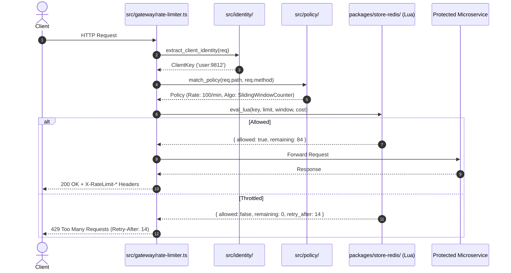

# Full Project Analysis: Rate Limit Gateway

## System Sequence Trace

```mermaid
sequenceDiagram
    autonumber
    actor Client
    participant GW as src/gateway/rate-limiter.ts
    participant ID as src/identity/
    participant Policy as src/policy/
    participant Redis as packages/store-redis/ (Lua)
    participant Upstream as Protected Microservice

    Client->>GW: HTTP Request
    GW->>ID: extract_client_identity(req)
    ID-->>GW: ClientKey ('user:9812')
    GW->>Policy: match_policy(req.path, req.method)
    Policy-->>GW: Policy (Rate: 100/min, Algo: SlidingWindowCounter)
    GW->>Redis: eval_lua(key, limit, window, cost)
    alt Allowed
        Redis-->>GW: { allowed: true, remaining: 84 }
        GW->>Upstream: Forward Request
        Upstream-->>GW: Response
        GW-->>Client: 200 OK + X-RateLimit-* Headers
    else Throttled
        Redis-->>GW: { allowed: false, remaining: 0, retry_after: 14 }
        GW-->>Client: 429 Too Many Requests (Retry-After: 14)
    end
```
