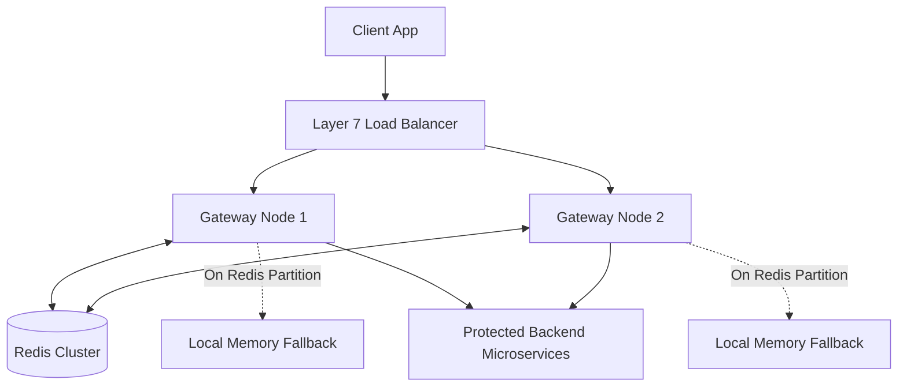

# System Architecture & Gateway Topology

```mermaid
flowchart TD
    Client[Client App] --> LB[Layer 7 Load Balancer]
    LB --> GW1[Gateway Node 1]
    LB --> GW2[Gateway Node 2]
    GW1 <--> Redis[(Redis Cluster)]
    GW2 <--> Redis
    GW1 -.->|On Redis Partition| LocalMem1[Local Memory Fallback]
    GW2 -.->|On Redis Partition| LocalMem2[Local Memory Fallback]
    GW1 --> Upstream[Protected Backend Microservices]
    GW2 --> Upstream
```
