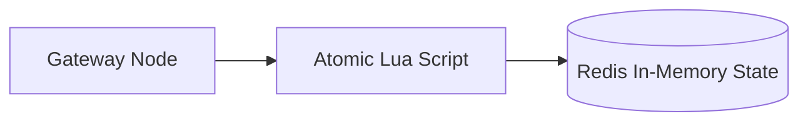

# 14.1 Requirements & Capacity Estimation

## Overview & Analysis
Capacity estimation for 100,000 RPS gateway throughput and Redis memory footprint.

```mermaid
flowchart LR
    GW[Gateway Node] --> Lua[Atomic Lua Script]
    Lua --> Redis[(Redis In-Memory State)]
```
