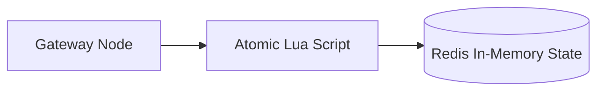

# 14.10 API Design & Standard Rate Limit Headers

## Overview & Analysis
IETF standard draft rate-limit headers (Limit, Remaining, Reset, Retry-After).

```mermaid
flowchart LR
    GW[Gateway Node] --> Lua[Atomic Lua Script]
    Lua --> Redis[(Redis In-Memory State)]
```
