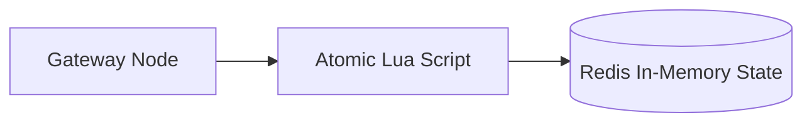

# 14.11 Security, CIDR Masking & Abuse Protection

## Overview & Analysis
Mitigating distributed botnet rotation and credential stuffing.

```mermaid
flowchart LR
    GW[Gateway Node] --> Lua[Atomic Lua Script]
    Lua --> Redis[(Redis In-Memory State)]
```
