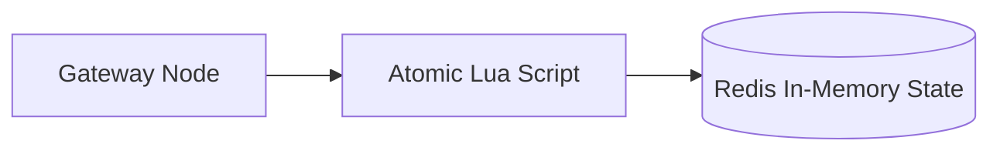

# 14.12 Search & AI Anomaly Detection

## Overview & Analysis
Real-time client behavior anomaly classification.

```mermaid
flowchart LR
    GW[Gateway Node] --> Lua[Atomic Lua Script]
    Lua --> Redis[(Redis In-Memory State)]
```
