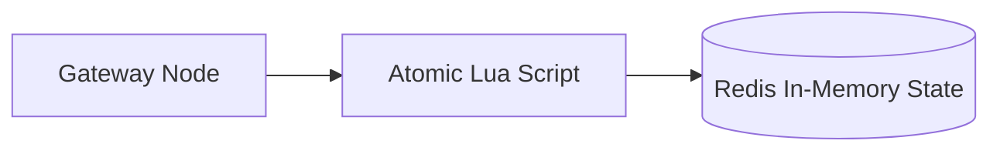

# 14.14 Observability & Prometheus Metrics

## Overview & Analysis
Prometheus metrics (`rate_limit_hits_total`, `rate_limit_exceeded_total`).

```mermaid
flowchart LR
    GW[Gateway Node] --> Lua[Atomic Lua Script]
    Lua --> Redis[(Redis In-Memory State)]
```
