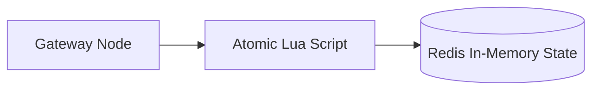

# 14.15 Performance Engineering & Sub-Millisecond Overhead

## Overview & Analysis
Zero-copy byte buffers and sub-millisecond evaluation latency.

```mermaid
flowchart LR
    GW[Gateway Node] --> Lua[Atomic Lua Script]
    Lua --> Redis[(Redis In-Memory State)]
```
