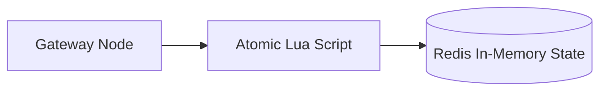

# 14.16 Cost Modeling & Infrastructure Scaling

## Overview & Analysis
Monthly running cost of 3-node Redis cluster and gateway fleet.

```mermaid
flowchart LR
    GW[Gateway Node] --> Lua[Atomic Lua Script]
    Lua --> Redis[(Redis In-Memory State)]
```
