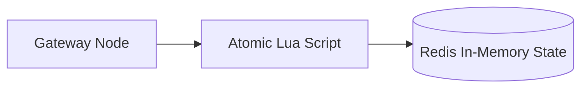

# 14.2 Architecture Styles & Gateway Topologies

## Overview & Analysis
Sidecar vs API Gateway vs In-Process library deployment models.

```mermaid
flowchart LR
    GW[Gateway Node] --> Lua[Atomic Lua Script]
    Lua --> Redis[(Redis In-Memory State)]
```
