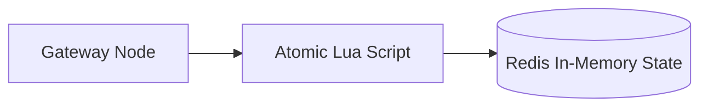

# 14.3 Networking & HTTP Reverse Proxying

## Overview & Analysis
HTTP/2 connection pooling, keep-alive, and header forwarding.

```mermaid
flowchart LR
    GW[Gateway Node] --> Lua[Atomic Lua Script]
    Lua --> Redis[(Redis In-Memory State)]
```
