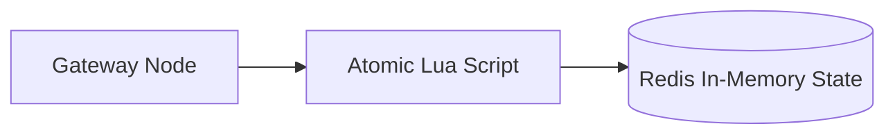

# 14.4 Load Balancing & Gateway Sharding

## Overview & Analysis
Layer 7 routing and Redis key partitioning.

```mermaid
flowchart LR
    GW[Gateway Node] --> Lua[Atomic Lua Script]
    Lua --> Redis[(Redis In-Memory State)]
```
