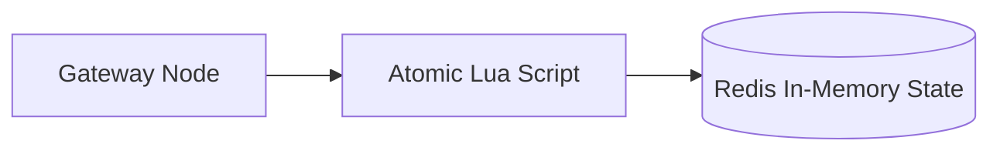

# 14.5 Databases & In-Memory Redis Storage

## Overview & Analysis
Redis in-memory key storage, volatile-lru eviction, and persistence trade-offs.

```mermaid
flowchart LR
    GW[Gateway Node] --> Lua[Atomic Lua Script]
    Lua --> Redis[(Redis In-Memory State)]
```
