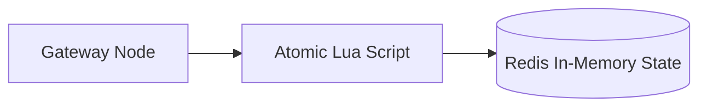

# 14.6 Caching & Tiered Counters

## Overview & Analysis
L1 in-memory local cache with L2 Redis synchronization.

```mermaid
flowchart LR
    GW[Gateway Node] --> Lua[Atomic Lua Script]
    Lua --> Redis[(Redis In-Memory State)]
```
