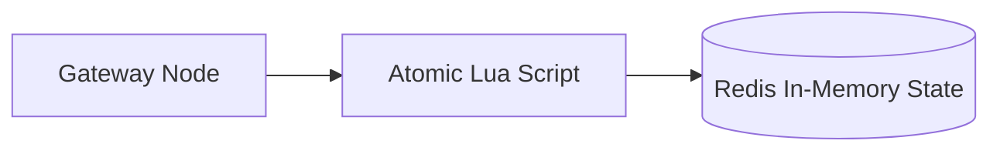

# 14.7 Messaging & Async Quota Synchronization

## Overview & Analysis
Batching token replenishment asynchronously via Redis pipelines.

```mermaid
flowchart LR
    GW[Gateway Node] --> Lua[Atomic Lua Script]
    Lua --> Redis[(Redis In-Memory State)]
```
