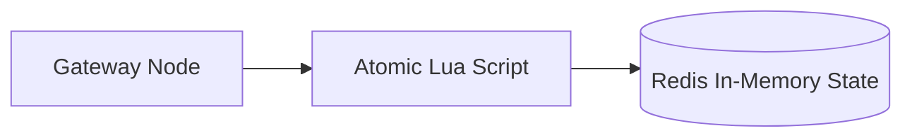

# 14.8 Consistency, Concurrency & Lua Scripts

## Overview & Analysis
Atomic execution in single-threaded Redis vs distributed locks.

```mermaid
flowchart LR
    GW[Gateway Node] --> Lua[Atomic Lua Script]
    Lua --> Redis[(Redis In-Memory State)]
```
