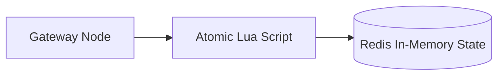

# 14.9 Reliability, Circuit Breakers & Failover

## Overview & Analysis
Circuit breaker fallback to local memory during Redis network partitions.

```mermaid
flowchart LR
    GW[Gateway Node] --> Lua[Atomic Lua Script]
    Lua --> Redis[(Redis In-Memory State)]
```
