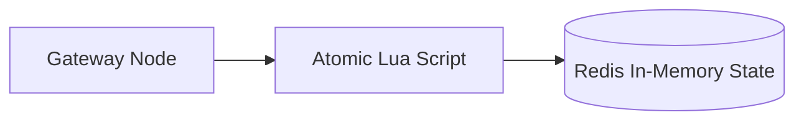

# Architecture Decision Records (ADR Log)

## Overview & Analysis
ADRs: Redis Lua Scripting, Sliding Window Counter default, and Circuit Breaker memory fallback.

```mermaid
flowchart LR
    GW[Gateway Node] --> Lua[Atomic Lua Script]
    Lua --> Redis[(Redis In-Memory State)]
```
