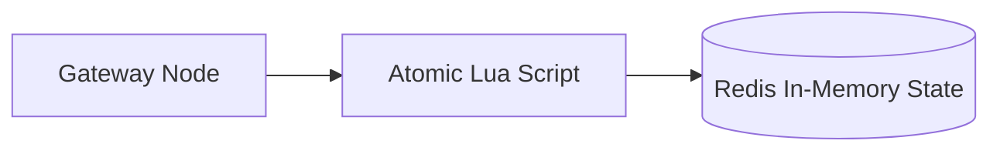

# System Design: Distributed Rate Limiting Gateway

## Overview & Analysis
Architecture, capacity, and reliability design for multi-tenant API protection.

```mermaid
flowchart LR
    GW[Gateway Node] --> Lua[Atomic Lua Script]
    Lua --> Redis[(Redis In-Memory State)]
```
